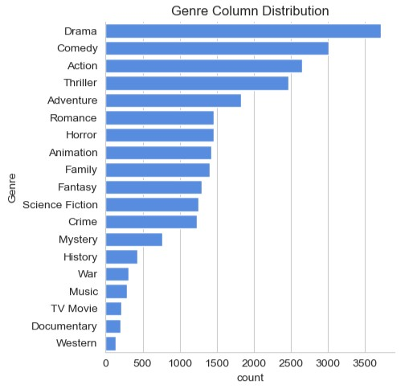
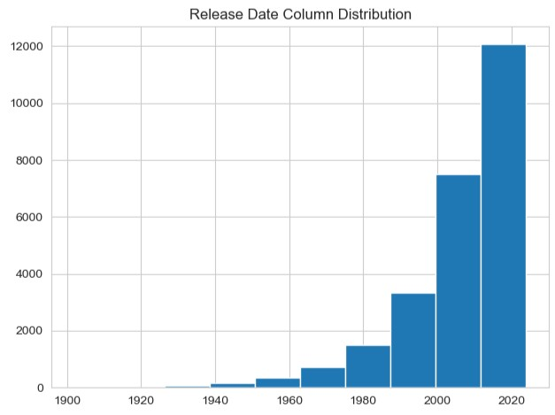
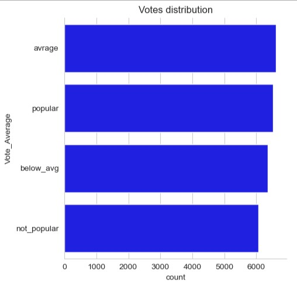

# 🎬 Netflix Movie Data Analysis

## 📌 Project Overview

This project focuses on analyzing a Netflix movie dataset using Python. The goal is to clean the data, explore movie trends, and answer business-oriented questions through Exploratory Data Analysis (EDA) and visualizations.

The analysis highlights patterns in movie genres, popularity, ratings, and release years to better understand the dataset.

---

## 📸 Project Preview

### Genre Distribution



### Release Year Analysis



### Vote Average Distribution



---

## 🎯 Objectives

* Clean and preprocess the dataset.
* Analyze the distribution of movie genres.
* Categorize movies based on vote average.
* Identify the most and least popular movies.
* Analyze movie release trends over the years.
* Create visualizations to communicate insights effectively.

---

## 🛠️ Technologies Used

* Python
* Pandas
* NumPy
* Matplotlib
* Seaborn
* Jupyter Notebook

---

## 📂 Dataset

The dataset contains information about Netflix movies, including:

* Release Date
* Title
* Overview
* Popularity
* Vote Count
* Vote Average
* Original Language
* Genre
* Poster URL

---

## 📊 Analysis Performed

* Data Cleaning and Preprocessing
* Data Type Conversion
* Genre Splitting and Transformation
* Vote Average Categorization
* Exploratory Data Analysis (EDA)
* Statistical Summary
* Data Visualization

---

## 📈 Key Insights

* Drama is the most frequently occurring genre in the dataset.
* A large portion of movies falls into the **Popular** vote category.
* Highly popular movies can be identified using the popularity metric.
* Movie production has increased significantly in recent years.
* Genre distribution and release trends provide useful insights into Netflix's movie catalog.

---

## ▶️ How to Run

1. Clone this repository.

2. Install the required libraries.

```bash
pip install pandas numpy matplotlib seaborn
```

3. Open the Jupyter Notebook.

```bash
jupyter notebook
```

4. Run the notebook cells sequentially.

---

## 📁 Project Structure

```text
Netflix-Movie-Data-Analysis/
├── images/
│   ├── gener_colum_distribution.jpg
│   ├── release_date_column_distribution.jpg
│   └── vote_disribution.jpg
├── .gitignore
|── Netflix Movie Data Analysis.ipynb
├── README.md
└── netflixmoviedb.csv
```

---

## 🚀 Skills Gained

* Data Cleaning
* Data Preprocessing
* Exploratory Data Analysis (EDA)
* Data Visualization

---

## 🔮 Future Improvements

* Explore trends across different movie genres over time.
* Analyze the relationship between popularity and vote ratings.
* Compare movie trends based on original languages.
* Add additional visualizations to uncover more insights.

---

## 👨‍💻 Author

**Ambuj Dwivedi**

🔗 **LinkedIn:** https://www.linkedin.com/in/ambuj-dwivedi07/

If you found this project helpful or have any suggestions, feel free to connect with me on LinkedIn.
